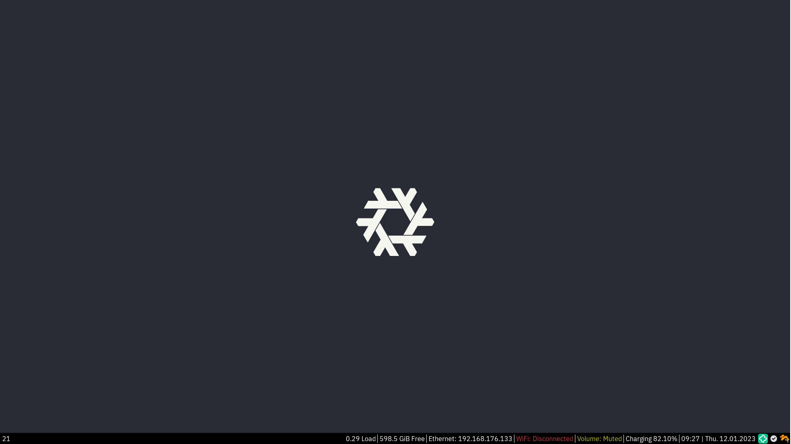

# NixOS Lenovo T14 Configuration

> For further information, please refer to the [documentation](https://nixos.org/manual/nixos/stable/)



## Getting Started

Build the project

```sh
# Update channels
nix-channel update
# Update system
nixos-rebuild switch  --flake '.#stefan' --upgrade
```

### VS Code

i3 config

```json
...
"files.associations": {
    "**/.i3/config": "i3",
    "**/i3/config": "i3",
    "**/i3/config/*": "i3",
},
...
```

### i3

```sh
# Restart and reload
i3-msg reload
i3-msg restart
```

## NixOS Flake

### Overview of Flakes (and why you want it)

Flakes is a few things:
* `flake.nix`: a Nix file, with a specific structure to describe inputs and outputs for a Nix project
  * See [NixOS Wiki - Flakes - Input Schema](https://nixos.wiki/wiki/Flakes#Input_schema) for flake input examples
  * See [NixOS Wiki - Flakes - Output Schema](https://nixos.wiki/wiki/Flakes#Input_schema) for flake output examples
* `flake.lock`: a manifest that "locks" inputs and records the exact versions in use
* CLI support for flake-related features
* pure (by default) evaluations

This ultimately enables:
* properly hermetic builds
* fully reproducable and portable Nix projects
* faster Nix operations due to evaluation caching enabled by pure evaluations)

This removes the need for:
* using `niv` or other tooling to lock dependencies
* manually documenting or scripting to ensure `NIX_PATH` is set consistently for your team
* the need for the *"the impure eval tree of sorrow"* that comes with all of today's Nix impurities

### Important Related Reading

* [NixOS Wiki - Flakes](https://nixos.wiki/wiki/Flakes)
  * a somewhat haphazard collection of factoids/snippets related to flakes
  * particularly look at: **[Flake Schema](https://nixos.wiki/wiki/Flakes#Flake_schema)**, and it's two sections: **[Input Schema](https://nixos.wiki/wiki/Flakes#Input_schema)**, **[Output Schema](https://nixos.wiki/wiki/Flakes#Output_schema)**
* [Tweag - NixOS flakes](https://www.tweag.io/blog/2020-07-31-nixos-flakes/)
  * this article describes how to enable flake support in `nix` and `nix-daemon`
  * reading this article is a **pre-requisite**
  * this README.md assumes you've enabled flakes system-wide
  * omit using `boot.isContainer = true;` on `configuration.nix` (as the article suggests) if you want to use `nixos-rebuild` rather than `nixos-container` 

### Nix CLI - Flakes Usage

Nix is in flakes mode when:
* `--flake` is used with the `nixos-rebuild` command
* or, when `nix build` is used with an argument like `'.#something'`  (the hash symbol separates the flake source from the attribute to build)

When in this mode:
* Nix flake commands will implicitly take a directory path, it expects a `flake.nix` inside
* when you see: `nix build '.#something'`, the `.` means current directory, and `#something` means to build the `something` output attribute

#### Useful Commands and Examples
##### nixos-rebuild
* `nixos-rebuild build --flake '.#'`
  * looks for `flake.nix` in `.` (current dir)
  * since it's `nixos-rebuild`, it automatically tries to build:
    * `#nixosConfigurations.{hostname}.config.system.build.toplevel`
* `nixos-rebuild build --flake '/code/nixos-config#mysystem'`
  * looks for `flake.nix` in `/code/nixos-config`
  * since it's `nixos-rebuild`, it automatically tries to build:
    * `#nixosConfigurations.mysystem.config.system.build.toplevel`
    * (note that this time we specifically asked, and got to build the `mysystem` config)
##### nix build
* `nix build 'github:colemickens/nixpkgs-wayland#obs-studio'`
  * looks for `flake.nix`  in (a checkout of `github.com/colemickens/nixpkgs-wayland`)
  * builds and run the first attribute found:
    * `#obs-studio`
    * `#packages.{currentSystem}.obs-studio`
    * TODO: finish fleshing out this list
##### nix flake
* `nix flake update --recreate-lock-file`
  * updates all inputs and recreating `flake.lock`
* `nix flake update --update-input nixpkgs`
  * updates a single input to latest and recording it in `flake.lock`


## Keyboard Configuration

> More information [documentation](https://nixos.org/manual/nixos/stable/index.html#custom-xkb-layouts)

By default, I use a US layout. However, I need german umlauts so I added a custom layout. Only one problem is that I cannot set it as default. Please run:

```sh
setxkbmap us-de
```

## Printer Configuration

For personal use, I have Canon printers like MF522. To add a printer please refer to the [documentation](http://localhost:631/)

```sh
lpadmin -p Canon-XXXXX -E -v ipp://XXX.XXX.X.XX/ipp/print -m everywhere
```

## Networkmanager

* `tmui`: configure Wifi connection

## Display & Screens

Set `multilockscreen`:

```sh
multilockscreen -u path_to_file --fx dim,pixel
```

Set background:

```sh
nitrogen --no-recurse ~/Documents/git/nixos-artwork/wallpapers
```

Set up new display:

```sh
# See what displays are available
xrandr
# Set display
xrandr --output DisplayPort-1 --auto --left-of eDP
# Save
autorandr --save
```

## Other

* `nitrogen`: Change background
* `multilockscreen`: Lock i3

## Credits

* [NixOS Flake Example](https://github.com/colemickens/nixos-flake-example)
* [vyorkin](https://github.com/vyorkin/nixos-config/)